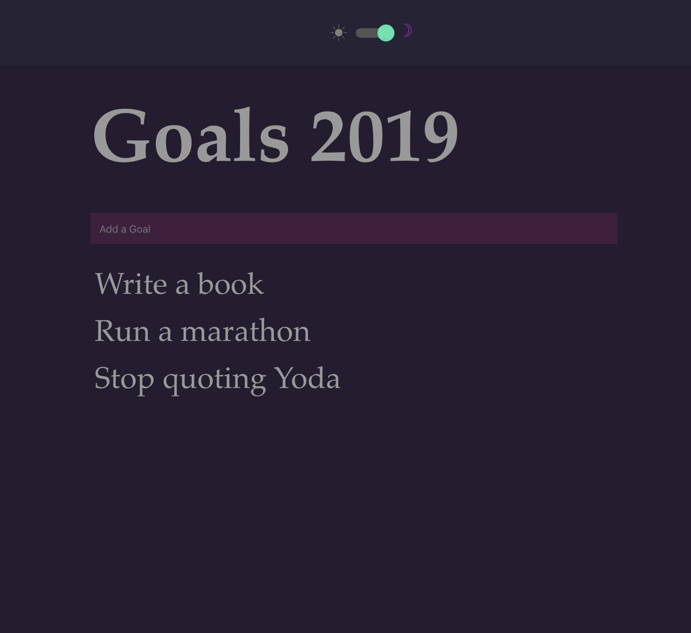

# Goals App for 2020

## Details

Minimalistic app for storing my Goals for the year. Goals stored in local storage. Implimented dark mode because it's trendy.

## Dark Mode

* Users prefered mode is automatically set using window.matchMedia from the window api.
* If user is returning to app then prefered colour theme is set from last visit.
* Prefered colour theme is saved to local storage.
* Theme is managed using Context

## Goals

* Goals are saved to local storage
* State is managed using Context

### Summary

* Responsive
* Uses Hooks
* Uses Context
* Dark mode which is trendy as of December 2019

#### Light Mode

#### Dark Mode

